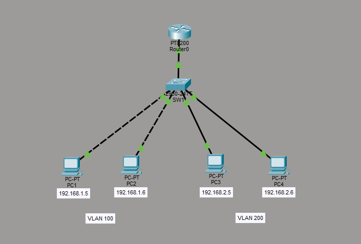
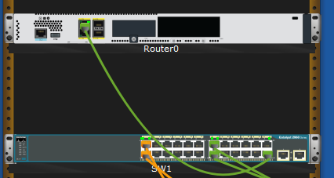
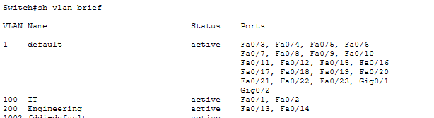
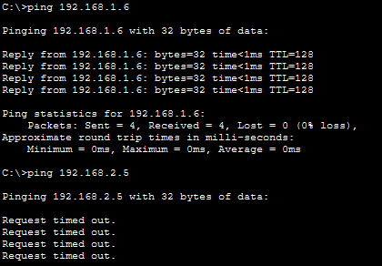
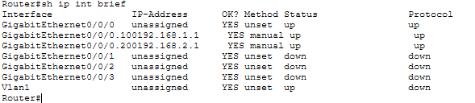
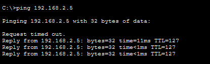
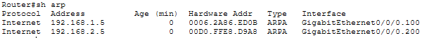

# Basic Layer 3 Connectivity

Cisco PT lab with the objective of creating a basic layer 3 network enabling connectivity between all devices where the network consists of 4 devices, separated into 2 VLANs and subnets.



## Step 1: Physical and device config

I started by adding the assets in the ‘Physical’ section of PT, placing a switch and router in a rack and 4 PCs. I directly connected PC1-2 in Fa0/1-Fa0/2 and PC3-4 in Fa0/13-Fa0/14 and connected to the router in Fa0/24 to port Gi0/0/0 in the router.



After this, I set a static IP address, subnet mask and default gateway on each device. 

On PC1 and PC2 I set 192.168.1.5/24 and 192.168.1.6/24 and I set the default gateway to 192.168.1.1.

On PC3 and PC4 I set 192.168.2.5/24 and 192.168.2.6/24 and I set the default gateway to 192.168.2.1.

## Step 2: VLAN config

With the physical connectivity done I then went into the switch CLI to configure 2 VLANs. I created both VLAN 100 named IT and VLAN 200 named Engineering.

```bash
enable
conf t
vlan 100
name IT
exit
```
After that I assigned the corresponding ports to each VLAN.

```bash
conf t
int Fa0/1
switchport mode access
switchport access vlan 100
no shut
end
```
I then verified the ports were on the correct VLANs and verified that the devices had connectivity to the other device in the same VLAN but not the other.





## Step 3: Connecting the switch to the router

After verifying that layer 2 connectivity is working as expected, I configured a trunk port on the switch and the subinterfaces on the router, assigning the relevant default gateway. 

```bash
Switch

conf t
int fa0/24
switchport mode trunk
switchport trunk allowed vlan 100,200
no shut
end
```

```bash
Router

enable
conf t
int Gi0/0/0
no shut
exit

int Gi0/0/0.100
encapsulation dot1Q 100
ip address 192.168.1.1 255.255.255.0

int Gi0/0/0.200
encapsulation dot1Q 200
ip address 192.168.2.1 255.255.255.0
end
```


## Step 4: Confirming connectivity

Once I finished configuring the switch and router, I went back into PC1 (192.168.1.5) and attempted a ping to 192.168.2.5 and confirmed connectivity and additionally that the router’s ARP table had updated.




